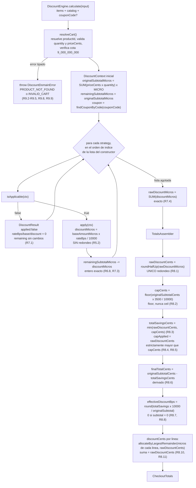
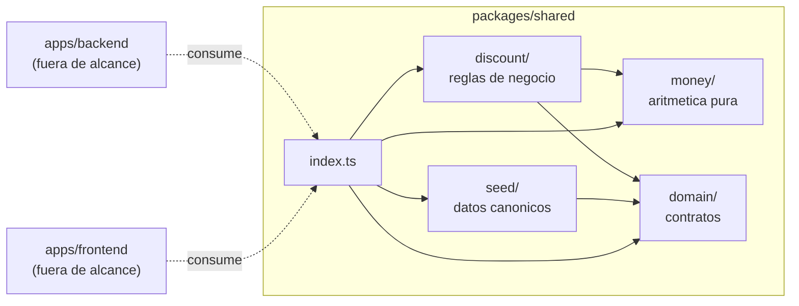

# Design Document

## Overview

Esta spec construye dos cosas: la **raíz del monorepo** (npm workspaces + `tsconfig.base.json`
+ `.gitignore` + script agregador `test:cov`) y el **paquete `packages/shared`** completo:
contratos del dominio, seed canónico de catálogo y cupones, utilidades de dinero en aritmética
entera, y el motor de descuentos acumulativos con sus tres estrategias, su factory y su suite
de Vitest con umbral de cobertura propio.

`apps/backend` y `apps/frontend` quedan **fuera de alcance**. Solo aparecen como consumidores
futuros de los contratos: los patrones de `workspaces` los contemplan (`apps/*`), pero en esta
spec no se crean ni se instalan sus dependencias (R1.1, R1.9).

### Principio rector

1. **El motor es puro.** `packages/shared` no importa NestJS, Prisma, clientes HTTP, `fs` ni
   nada de red. Recibe datos, devuelve un `CheckoutTotals`. Esto es lo que permite testear la
   matemática en aislamiento y reutilizarla desde ambos lados (R10.1, R10.8).
2. **El redondeo tiene una sola implementación y un solo punto de aplicación.** La cascada corre
   en micro-centavos exactos (`MICRO = 1_000_000`) sin redondear en ningún paso intermedio; el
   único `roundHalfUp` vive en el **Ensamblador_Totales** del motor. Las estrategias devuelven
   montos exactos y no conocen los centavos (R5.2, R7.3, R8.1).
3. **El tope del 35% es un invariante defensivo, no un paso alcanzable.** El máximo real de la
   cascada es `1 − (0.90 × 0.95 × 0.85) = 27.325%`, y solo en un carrito 100% `Tecnologia`. El
   tope se implementa y se verifica igual, porque protege el margen ante cualquier regla futura;
   para probarlo se inyectan estrategias stub en el constructor del motor, y para demostrarlo en
   vivo existe el cupón de extensión `DEMOCAP50` (R6.7, R8.2–R8.5, R13.1–R13.4).
4. **Cero escapes de tipado.** Sin `any`, sin `as` de silenciamiento, sin `@ts-ignore`. Los
   conjuntos cerrados se derivan de un arreglo `as const`. Todo monto es entero verificable con
   `Number.isInteger`; toda tasa es un entero en puntos básicos aplicado como `× bps / 10000`
   (R2.1, R10.3, R10.4, R8.14).

### Trazabilidad de alcance

| Entregable | Requerimientos |
|-----------|----------------|
| Raíz: `package.json`, `tsconfig.base.json`, `.gitignore`, `test:cov` agregador | R1 |
| Contratos del dominio y punto de entrada público | R2, R10 |
| Seed de catálogo y cupones | R3 |
| Utilidades de dinero | R4 |
| Estrategias de descuento | R5 |
| Factory + motor por inyección | R6 |
| Cascada exacta | R7 |
| Ensamblador de totales | R8 |
| Validación y errores tipados | R9 |
| Suite de pruebas y cobertura | R12, R13 |
| Invariantes por propiedades | R11 |

---

## Architecture

### Estructura de archivos

```
core-e-commerce/
├── package.json              # private:true, workspaces ['apps/*','packages/*'], test:cov agregador (R1.1, R1.2, R1.6)
├── tsconfig.base.json        # única fuente de strict / noImplicitAny / strictNullChecks (R1.3)
├── .gitignore                # node_modules, dist, coverage, *.db (R1.5)
├── package-lock.json         # único lock, en la raíz (R1.8)
├── apps/                     # vacío en esta spec; el patrón apps/* no resuelve nada (R1.9)
└── packages/
    └── shared/
        ├── package.json      # name @core/shared, sin dependencies, solo devDependencies (R10.1)
        ├── tsconfig.json     # extends ../../tsconfig.base.json (R1.4, R10.6)
        ├── vitest.config.ts  # coverage thresholds 80/80 en líneas y ramas (R12.2)
        └── src/
            ├── index.ts                          # punto de entrada público (R2.9, R6.5)
            ├── domain/
            │   ├── categories.ts                 # PRODUCT_CATEGORIES, ProductCategory, CATEGORY_LABEL (R2.1, R2.2)
            │   ├── product.ts                    # Product, CartItem (R2.3, R2.4)
            │   ├── coupon.ts                     # COUPON_STATUSES, CouponStatus, Coupon (R3.2, R3.4)
            │   ├── discount.contracts.ts         # DISCOUNT_NAMES, DiscountName, DiscountLine, CheckoutTotals (R2.5–R2.7)
            │   └── errors.ts                     # ERROR_CODES, ErrorCode, ApiError, DiscountDomainError (R2.8, R9.6)
            ├── seed/
            │   ├── catalog.seed.ts               # CATALOG_PRODUCTS, findProductById (R3.1, R3.7, R3.8)
            │   └── coupons.seed.ts               # COUPONS, findCouponByCode (R3.2–R3.6)
            ├── money/
            │   ├── micro.ts                      # MICRO, toMicros, roundHalfUp, applyBps (R4.1–R4.4)
            │   ├── allocate.ts                   # allocateByLargestRemainder (R4.6–R4.8, R4.10)
            │   └── format.ts                     # formatCents (R4.5)
            └── discount/
                ├── discount.types.ts             # DiscountStrategy, DiscountContext, DiscountResult, ResolvedCartLine (R5.1, R5.14, R5.15)
                ├── discount.labels.ts            # DISCOUNT_LABEL: Record<DiscountName, string> (R5.13)
                ├── strategies/
                │   ├── category.discount.ts      # CategoryDiscount (R5.3–R5.5)
                │   ├── volume.discount.ts        # VolumeDiscount (R5.6–R5.9)
                │   └── coupon.discount.ts        # CouponDiscount (R5.10–R5.12)
                ├── discount-strategy.factory.ts  # DiscountStrategyFactory (R6.1)
                ├── cart-resolver.ts              # resolución + validación del carrito (R9.2–R9.5, R9.8, R9.9)
                ├── totals-assembler.ts           # Ensamblador_Totales: el único que redondea (R8)
                └── discount-engine.ts            # DiscountEngine (R6.2–R6.8, R7)
```

Los módulos se agrupan por responsabilidad, no por tipo de artefacto: `domain/` son contratos sin
lógica, `seed/` son datos canónicos, `money/` es aritmética pura sin conocimiento del dominio, y
`discount/` es la única carpeta con reglas de negocio. `index.ts` es la fachada: un consumidor
importa desde el paquete y nunca desde rutas internas (R2.9).

### Flujo de la cascada y del ensamblado de totales



### Capas y dependencias internas



Las flechas nunca apuntan hacia afuera del paquete: `discount/` depende de `money/` y `domain/`,
y nada dentro de `packages/shared` depende de los `apps/*` (R10.1).

### Raíz del monorepo

```jsonc
// package.json (raíz)
{
  "name": "core-e-commerce",
  "private": true,                                  // R1.2
  "workspaces": ["apps/*", "packages/*"],           // exactamente dos patrones (R1.1)
  "scripts": {
    "build": "tsc -b",
    "typecheck": "npm run typecheck --workspaces --if-present",
    "test": "npm run test --workspaces --if-present",
    "test:cov": "npm run test:cov --workspaces --if-present"   // R1.6, R1.7, R1.9
  }
}
```

`npm run test:cov --workspaces --if-present` cumple los tres criterios del script agregador sin
scripting propio: npm recorre los workspaces **en el orden en que resuelven los patrones de
`workspaces`**, se detiene en el primer código de salida distinto de cero, imprime el workspace
que falló y propaga el código de salida (R1.6, R1.7). `--if-present` evita fallar por workspaces
que no declaran el script, y los patrones que no resuelven paquetes —hoy `apps/*`— se omiten sin
error (R1.9). Se verifica en la fase de tareas con una ejecución real, forzando un fallo en
`packages/shared` para observar el código de salida y el mensaje.

```jsonc
// tsconfig.base.json — única declaración de los tres flags en todo el monorepo (R1.3)
{
  "compilerOptions": {
    "strict": true,
    "noImplicitAny": true,
    "strictNullChecks": true,
    "target": "ES2022",
    "module": "NodeNext",
    "moduleResolution": "NodeNext",
    "declaration": true,
    "noUncheckedIndexedAccess": true,
    "exactOptionalPropertyTypes": true,
    "forceConsistentCasingInFileNames": true
  }
}
```

`noUncheckedIndexedAccess` y `exactOptionalPropertyTypes` no son decorativos: el primero obliga a
narrowing al indexar el catálogo y las listas de líneas (y así el reparto por mayor resto no puede
asumir índices), y el segundo hace que `details?: Record<string, unknown>` signifique
verdaderamente "ausente" y no "presente con `undefined`" (R2.8).

`packages/shared/tsconfig.json` usa `"extends": "../../tsconfig.base.json"` y **no** redeclara los
tres flags (R1.4, R10.6).

`.gitignore` de la raíz: `node_modules`, `dist`, `coverage`, `*.db` (R1.5).

---

## Components and Interfaces

Todas las firmas de esta sección son el código real que se escribirá, no pseudocódigo. Ninguna
usa `any` ni aserciones de silenciamiento (R10.4).

### `money/micro.ts` — escala y redondeo (R4.1–R4.4)

```ts
/** Escala de micro-centavos: 1 centavo = 1_000_000 micro-centavos. */
export const MICRO = 1_000_000;

/** Cota de exactitud de la escala frente a Number.MAX_SAFE_INTEGER. */
export const MAX_SUBTOTAL_CENTS = 9_000_000_000;

/** Denominador de los puntos básicos: 100% = 10000 bps. */
export const BPS_DENOMINATOR = 10_000;

export const toMicros = (cents: number): number => cents * MICRO;

/**
 * Único redondeo autorizado del sistema. Todos los montos son positivos,
 * así que Math.round es half-up sin ambigüedad de signo.
 */
export const roundHalfUp = (micros: number): number => Math.round(micros / MICRO);

/** Aplica una tasa entera en puntos básicos sobre un monto en micro-centavos. */
export const applyBps = (amountMicros: number, bps: number): number =>
  (amountMicros * bps) / BPS_DENOMINATOR;
```

`applyBps` divide, pero el resultado es entero exacto en toda la cascada de producción: los
denominadores acumulados de las tres tasas son 10, 20 y 20, y su producto (4000) divide a
`MICRO = 1_000_000`. Por eso ningún paso intermedio necesita redondear (R7.2, R7.3). Los stubs de
prueba eligen bps que también dividen exactamente, de modo que el invariante de enteros se
mantiene también en los tests del tope (R13.2).

### `money/allocate.ts` — reparto por mayor resto (R4.6–R4.8, R4.10)

```ts
/**
 * Reparte `targetCents` entre las posiciones de `amountsMicros` de modo que
 * la suma del resultado sea exactamente `targetCents`.
 *
 * - parte del piso Math.floor(m / MICRO) de cada posición,
 * - asigna un centavo por vez a las posiciones de mayor resto (m mod MICRO),
 * - ante restos iguales, gana la posición de menor índice (determinismo).
 *
 * Función pura: no muta la entrada y no valida (ver R4.11).
 */
export const allocateByLargestRemainder = (
  amountsMicros: readonly number[],
  targetCents: number,
): number[] => { /* ... */ };
```

El desempate por menor índice es lo que hace determinista el reparto: con las estrategias del
factory el orden de índice es exactamente el orden de precedencia `CATEGORY`, `VOLUME`, `COUPON`
(R4.8, R8.10). Lista vacía con objetivo `0` devuelve `[]` sin excepción (R4.10).

### `money/format.ts` — formateo compartido (R4.5)

```ts
/**
 * 129900 -> '$1,299.00' | 0 -> '$0.00' | 1990 -> '$19.90' | 100000000 -> '$1,000,000.00'
 * Agrupa la parte entera con Intl sobre un entero y concatena los dos decimales
 * como cadena: nunca se formatea un float ni se usa toFixed sobre un monto (R4.9).
 */
export const formatCents = (cents: number): string => {
  const whole = Math.trunc(cents / 100);
  const frac = cents % 100;
  const grouped = new Intl.NumberFormat('en-US').format(whole);
  return `$${grouped}.${String(frac).padStart(2, '0')}`;
};
```

`formatCents` es dueño único del formateo de dinero para todo el monorepo: el backend y el frontend
lo importan en lugar de reimplementarlo, y así el mismo monto se pinta idéntico en el carrito, en
el desglose y en la confirmación.

### `discount/discount.types.ts` — contrato de las estrategias (R5.1, R5.14, R5.15)

```ts
export interface ResolvedCartLine {
  readonly productId: string;
  readonly category: ProductCategory;
  readonly priceCents: number;   // entero >= 0
  readonly quantity: number;     // entero > 0
}

export interface DiscountContext {
  readonly lines: readonly ResolvedCartLine[];
  readonly originalSubtotalMicros: number;
  readonly remainingSubtotalMicros: number;
  readonly coupon?: Coupon;      // cupón ya resuelto contra el registro
}

export interface DiscountResult {
  readonly name: DiscountName;
  readonly applied: boolean;
  readonly rateBps: number;            // entero 0..10000
  readonly baseAmountMicros: number;   // entero >= 0
  readonly discountMicros: number;     // entero >= 0, exacto, sin redondear
}

export interface DiscountStrategy {
  readonly name: DiscountName;
  readonly order: number;
  isApplicable(ctx: DiscountContext): boolean;
  apply(ctx: DiscountContext): DiscountResult;
}
```

`DiscountResult` **no tiene ningún campo en centavos**: la conversión a centavos es exclusiva del
Ensamblador_Totales (R5.2, R5.15). `DiscountContext` es de solo lectura en todos sus campos, lo que
respalda por tipos el requisito de no mutación (R5.16, R6.2).

### `discount/discount.labels.ts` — etiquetas del desglose (R5.13)

```ts
export const DISCOUNT_LABEL: Record<DiscountName, string> = {
  CATEGORY: `Descuento ${CATEGORY_LABEL.Tecnologia} 10%`,  // 'Descuento Tecnología 10%'
  VOLUME: 'Descuento por volumen 5%',
  COUPON: 'Cupón',
};
```

El `label` de la línea lo pone el ensamblador desde este `Record`, no la estrategia: así una línea
no aplicada conserva `name` y un `label` no vacío con todos sus montos en `0` (R5.13, R8.9). La
etiqueta de categoría se deriva de `CATEGORY_LABEL.Tecnologia`, nunca se escribe la cadena con
tilde a mano (R10.5). Estos textos son mínimos y de presentación; el único texto canónico fijado
por el steering es la alerta del tope, y vive en la spec del frontend, fuera de alcance aquí.

### `discount/strategies/category.discount.ts` (R5.3–R5.5)

```ts
export class CategoryDiscount implements DiscountStrategy {
  readonly name = 'CATEGORY' as const;
  readonly order = 1;
  readonly rateBps = 1000;

  isApplicable(ctx: DiscountContext): boolean {
    return ctx.lines.some((line) => line.category === 'Tecnologia');
  }

  apply(ctx: DiscountContext): DiscountResult { /* ... */ }
}
```

`baseAmountMicros` es `toMicros` de la suma de `priceCents × quantity` de las líneas cuya
`category` es **estrictamente igual al literal `'Tecnologia'`**, sin tilde (R5.4). La comparación
contra `CATEGORY_LABEL.Tecnologia` está prohibida: no lanzaría error, simplemente no aplicaría el
descuento, y ese es exactamente el fallo silencioso que el steering ataca (R10.5). Sin líneas de
`Tecnologia`, `isApplicable` es `false` y `apply` —si se invoca de todas formas— devuelve
`applied: false` con base y descuento en `0`, sin excepción (R5.5).

### `discount/strategies/volume.discount.ts` (R5.6–R5.9)

```ts
export const VOLUME_THRESHOLD_CENTS = 10_000;

export class VolumeDiscount implements DiscountStrategy {
  readonly name = 'VOLUME' as const;
  readonly order = 2;
  readonly rateBps = 500;

  isApplicable(ctx: DiscountContext): boolean {
    return ctx.remainingSubtotalMicros > toMicros(VOLUME_THRESHOLD_CENTS);
  }

  apply(ctx: DiscountContext): DiscountResult { /* ... */ }
}
```

La comparación es **estrictamente mayor** y se hace **en micro-centavos sin redondear antes a
centavos**: exactamente `toMicros(10000)` no activa el 5%, `toMicros(10000) + 1` sí (R5.7, R5.8,
R13.6). `baseAmountMicros` es el remanente completo tras `CATEGORY`, es decir
`originalSubtotalMicros − discountMicros(CATEGORY)`, abarcando **todas** las categorías y no solo
`Tecnologia` (R5.9).

### `discount/strategies/coupon.discount.ts` (R5.10–R5.12)

```ts
export class CouponDiscount implements DiscountStrategy {
  readonly name = 'COUPON' as const;
  readonly order = 3;

  isApplicable(ctx: DiscountContext): boolean {
    return ctx.coupon !== undefined && ctx.coupon.status === 'active';
  }

  apply(ctx: DiscountContext): DiscountResult { /* ... */ }
}
```

`rateBps` sale del cupón resuelto (`1500` para `WELCOME2026`, `5000` para `DEMOCAP50`) y vale `0`
cuando no hay cupón resuelto (R5.10). `baseAmountMicros` es el remanente tras `VOLUME` y
`discountMicros = baseAmountMicros × rateBps / 10000`, sin redondeo intermedio (R5.11). Un código
no registrado, vacío o expirado devuelve `isApplicable === false` con `discountMicros` en `0`, sin
excepción y sin tocar los montos que aportaron `CATEGORY` y `VOLUME` (R5.12, R9.7).

### `discount/discount-strategy.factory.ts` (R6.1)

```ts
export class DiscountStrategyFactory {
  create(): readonly DiscountStrategy[] {
    return [new CategoryDiscount(), new VolumeDiscount(), new CouponDiscount()];
  }
}
```

Devuelve **siempre las tres**, ordenadas de forma ascendente por `order` (1, 2, 3), con
independencia de si resultan aplicables al contexto: el desglose de la UI necesita las tres líneas,
aplicadas o no (R6.1, R8.9). Añadir una cuarta regla se hace aquí, y el motor la recorre y emite su
línea sin modificarse (R6.4).

### `discount/cart-resolver.ts` (R9.2–R9.5, R9.8, R9.9)

```ts
export interface DiscountCalculationInput {
  readonly items: readonly CartItem[];
  readonly catalog: readonly Product[];
  readonly couponCode?: string;
}

/**
 * Resuelve cada CartItem contra el catálogo y valida la línea.
 * Recorre en orden ascendente de índice y, dentro de cada línea,
 * resuelve primero el productId y valida después quantity y priceCents.
 * Lanza únicamente el primer error detectado (R9.8).
 */
export const resolveCart = (input: DiscountCalculationInput): DiscountContext => { /* ... */ };
```

El motor expone `calculate(input: DiscountCalculationInput)` en lugar de recibir un
`DiscountContext` ya construido. La razón es de requisitos, no de comodidad: R9.5 obliga al motor a
lanzar `PRODUCT_NOT_FOUND` para un `productId` ausente del catálogo, y R9.8 fija el orden de
validación; ambas cosas ocurren **antes** de existir el contexto, cuyas líneas están ya resueltas
por definición (R5.14). Construir el contexto fuera del motor dejaría la validación fuera de la
pieza que los requisitos responsabilizan de ella. El `DiscountContext` sigue siendo el tipo que
viajan las estrategias, tal como lo describe el steering de arquitectura.

### `discount/totals-assembler.ts` (R8)

```ts
export const assembleTotals = (
  results: readonly DiscountResult[],
  originalSubtotalCents: number,
): CheckoutTotals => { /* único punto autorizado a redondear */ };
```

### `discount/discount-engine.ts` (R6.2–R6.8, R7)

```ts
export class DiscountEngine {
  constructor(private readonly strategies: readonly DiscountStrategy[]) {}

  calculate(input: DiscountCalculationInput): CheckoutTotals { /* ... */ }
}
```

El constructor **recibe** la lista y no construye, descubre ni completa estrategias internamente
(R6.2). El recorrido sigue el **orden de índice de la lista recibida**, sin reordenar por `order` ni
omitir elementos, consultando `isApplicable` una vez e invocando `apply` una sola vez por estrategia
aplicable (R6.3). Emite exactamente una `DiscountLine` por estrategia recibida: tres cuando se
construye desde el factory, `lines: []` cuando la lista está vacía (R6.4, R6.6). A cada estrategia
le entrega un contexto cuyo `remainingSubtotalMicros` es el valor exacto que dejó la anterior, sin
redondear ni truncar (R6.8, R7.1).

### Punto de entrada público (`src/index.ts`) (R2.9, R6.5)

Exportaciones nombradas: `PRODUCT_CATEGORIES`, `ProductCategory`, `CATEGORY_LABEL`, `Product`,
`CartItem`, `DiscountName`, `DiscountLine`, `CheckoutTotals`, `ErrorCode`, `ApiError`,
`DiscountDomainError`, `isDiscountDomainError`, `CATALOG_PRODUCTS`, `COUPONS`, `findProductById`,
`findCouponByCode`, `Coupon`, `CouponStatus`, `MICRO`, `toMicros`, `roundHalfUp`, `applyBps`,
`formatCents`, `allocateByLargestRemainder`, `DiscountStrategy`, `DiscountContext`,
`DiscountResult`, `DiscountStrategyFactory`, `DiscountEngine`, `DiscountCalculationInput`,
`CategoryDiscount`, `VolumeDiscount`, `CouponDiscount`, `DISCOUNT_LABEL`. Ningún consumidor
necesita recorrer rutas internas del paquete.

---

## Data Models

### Categorías (R2.1, R2.2, R10.3, R10.5)

```ts
export const PRODUCT_CATEGORIES = ['Tecnologia', 'Hogar', 'Ropa'] as const;
export type ProductCategory = (typeof PRODUCT_CATEGORIES)[number];

export const CATEGORY_LABEL: Record<ProductCategory, string> = {
  Tecnologia: 'Tecnología',
  Hogar: 'Hogar',
  Ropa: 'Ropa',
};
```

La unión no se escribe a mano en ningún sitio: se deriva del arreglo `as const` (R10.3). La clave es
el literal sin tilde y la tilde vive solo en el valor de etiqueta, así que asignar `'Tecnología'` a
un `ProductCategory` es un error de compilación y la divergencia no pasa en silencio (R2.11).

### Producto y línea de carrito (R2.3, R2.4)

```ts
export interface Product {
  readonly id: string;              // no vacío
  readonly name: string;            // no vacío
  readonly category: ProductCategory;
  readonly priceCents: number;      // entero >= 0
  readonly stock: number;           // entero >= 0
}

export interface CartItem {
  readonly productId: string;       // no vacío
  readonly quantity: number;        // entero >= 1
}
```

Las restricciones de "entero no negativo" y "cadena no vacía" no son expresables en el tipo
estructural de TypeScript; se garantizan por el seed (datos canónicos) y por la validación en
runtime del motor (R9), y se afirman en los tests con `Number.isInteger`.

### Descuentos (R2.5–R2.7)

```ts
export const DISCOUNT_NAMES = ['CATEGORY', 'VOLUME', 'COUPON'] as const;
export type DiscountName = (typeof DISCOUNT_NAMES)[number];  // orden = precedencia

export interface DiscountLine {
  name: DiscountName;
  label: string;              // texto listo para la UI, no vacío
  applied: boolean;
  rateBps: number;            // entero 0..10000
  baseAmountMicros: number;   // exacto
  baseAmountCents: number;    // derivado, SOLO presentación
  discountMicros: number;     // exacto, sin redondear
  discountCents: number;      // reparto por mayor resto; suma = rawDiscountCents
}

export interface CheckoutTotals {
  originalSubtotalCents: number;
  lines: DiscountLine[];          // 3 cuando el motor se arma desde el factory
  rawDiscountMicros: number;      // cascada exacta, antes de redondear y de topar
  rawDiscountCents: number;       // el único redondeo
  capCents: number;               // floor(originalSubtotal * 3500 / 10000)
  capApplied: boolean;            // true solo si rawDiscountCents > capCents
  totalSavingsCents: number;      // ya topado
  effectiveDiscountBps: number;   // round(totalSavings * 10000 / originalSubtotal)
  finalTotalCents: number;        // derivado: originalSubtotal - totalSavings
}
```

La forma es exactamente la del contrato de API del steering, sin campos extra ni ausentes: es el
tipo que `POST /api/checkout/preview` devolverá cuando se construya el backend (R2.7).

### Errores (R2.8, R9.6)

```ts
export const ERROR_CODES = ['INSUFFICIENT_STOCK', 'PRODUCT_NOT_FOUND', 'INVALID_CART'] as const;
export type ErrorCode = (typeof ERROR_CODES)[number];

export interface ApiError {
  error: { code: ErrorCode; message: string; details?: Record<string, unknown> };
}
```

`INSUFFICIENT_STOCK` se declara aquí porque el contrato de error es compartido, aunque quien lo
emita viva en el backend, fuera de alcance de esta spec.

### Cupón (R3.2, R3.4)

```ts
export const COUPON_STATUSES = ['active', 'expired'] as const;
export type CouponStatus = (typeof COUPON_STATUSES)[number];

export interface Coupon {
  readonly code: string;
  readonly rateBps: number;          // entero 0..10000, nunca float
  readonly status: CouponStatus;
  readonly isDemoExtension: boolean; // true solo en DEMOCAP50
}
```

### Seed canónico (R3.1–R3.8)

```ts
export const CATALOG_PRODUCTS = [
  { id: 'PROD-001', name: 'Laptop Pro 14"',        category: 'Tecnologia', priceCents: 129900, stock: 5  },
  { id: 'PROD-002', name: 'Auriculares Bluetooth', category: 'Tecnologia', priceCents: 7990,   stock: 12 },
  { id: 'PROD-003', name: 'Teclado Mecánico',      category: 'Tecnologia', priceCents: 4550,   stock: 8  },
  { id: 'PROD-004', name: 'Lámpara de Escritorio', category: 'Hogar',      priceCents: 3200,   stock: 15 },
  { id: 'PROD-005', name: 'Juego de Sábanas',      category: 'Hogar',      priceCents: 5900,   stock: 3  },
  { id: 'PROD-006', name: 'Camiseta Básica',       category: 'Ropa',       priceCents: 1990,   stock: 20 },
] as const satisfies readonly Product[];

export const COUPONS = [
  { code: 'WELCOME2026', rateBps: 1500, status: 'active',  isDemoExtension: false },
  { code: 'SUMMER2024',  rateBps: 2000, status: 'expired', isDemoExtension: false },
  // Extensión de demo ajena al enunciado: único camino para que la cascada supere
  // el tope del 35% con el catálogo real y se pueda demostrar el truncamiento.
  { code: 'DEMOCAP50',   rateBps: 5000, status: 'active',  isDemoExtension: true  },
] as const satisfies readonly Coupon[];

export const findProductById = (
  id: string,
  catalog: readonly Product[] = CATALOG_PRODUCTS,
): Product | undefined => catalog.find((p) => p.id === id);

export const findCouponByCode = (code: string): Coupon | undefined =>
  COUPONS.find((c) => c.code === code);
```

`as const satisfies readonly Product[]` es la combinación correcta bajo las reglas de tipado:
`as const` estrecha (permitido y preferido), y `satisfies` **verifica** contra el contrato sin
ensanchar el tipo ni silenciar nada (a diferencia de `as readonly Product[]`, que sí sería una
aserción). Si un precio cambiara a `string` o una categoría llevara tilde, la compilación falla ahí
mismo.

`findCouponByCode` compara por igualdad exacta, sensible a mayúsculas y minúsculas, sin normalizar
ni recortar la entrada, y devuelve el cupón también cuando está expirado —la decisión de ignorarlo
es de la estrategia, no del registro (R3.5). Ausencia = `undefined`, sin excepción y sin mutar el
registro (R3.6, R3.8). Este seed es la única definición de estos valores en el monorepo: el seed de
Prisma del backend los importará de aquí en lugar de duplicarlos (R3.7).

---

## Totals Assembler Algorithm

El ensamblador es el único punto del sistema autorizado a redondear (R8.1). Recibe los
`DiscountResult` exactos de la cascada y el `originalSubtotalCents`, y produce el `CheckoutTotals`
en este orden estricto:

1. **`rawDiscountMicros`** = suma exacta de los `discountMicros` de todas las estrategias aplicadas
   (las no aplicadas suman `0`). Sin redondeo (R7.4).
2. **`rawDiscountCents`** = `roundHalfUp(rawDiscountMicros)` = `Math.round(micros / MICRO)`. **El
   único redondeo de todo el cálculo** (R8.1).
3. **`capCents`** = `Math.floor(originalSubtotalCents × 3500 / 10000)`. Floor, nunca ceil: el
   descuento no puede *superar* el 35%, y redondear hacia arriba lo violaría por un centavo (R8.2).
4. **`totalSavingsCents`** = `Math.min(rawDiscountCents, capCents)` (R8.3).
5. **`capApplied`** = `rawDiscountCents > capCents`. Estrictamente mayor: un descuento de
   exactamente el 35% **no** activa el truncamiento ni la alerta (R8.4, R8.5).
6. **`finalTotalCents`** = `originalSubtotalCents − totalSavingsCents`. Se **deriva**, nunca se
   calcula por otra vía, de modo que no pueda desincronizarse del desglose (R8.6).
7. **`effectiveDiscountBps`** = `Math.round(totalSavingsCents × 10000 / originalSubtotalCents)`, y
   `0` sin ejecutar la división cuando `originalSubtotalCents === 0` (R8.7, R8.8).
8. **`discountCents` por línea** = `allocateByLargestRemainder(discountMicros[], rawDiscountCents)`:
   piso de cada línea y reparto del sobrante de a un centavo empezando por el mayor resto, con
   desempate por menor índice. La suma de las líneas iguala exactamente `rawDiscountCents`, también
   cuando `capApplied === true`; en ese caso la diferencia `rawDiscountCents − totalSavingsCents` es
   precisamente el monto truncado (R8.10, R8.11).
9. **`baseAmountCents`** por línea = `roundHalfUp(baseAmountMicros)`, campo de presentación con el
   que nunca se opera (R2.6).
10. Cada línea no aplicada se emite con `name`, `label` no vacío, `applied: false` y `rateBps`,
    `baseAmountMicros`, `baseAmountCents`, `discountMicros` y `discountCents` en `0` (R5.13, R8.9).

Todos los campos emitidos son enteros no negativos verificables con `Number.isInteger` (R8.14).

### Traza numérica del fixture canónico: 1 × `PROD-001` + `WELCOME2026`

Es el fixture que distingue la política correcta de la incorrecta, y por eso se congela en el
diseño (R7.6, R8.12, R13.13).

| paso | operación | valor exacto |
|------|-----------|--------------|
| subtotal | `129900 × MICRO` | `129_900_000_000` micros (`129900` centavos) |
| `CATEGORY` | base `129_900_000_000` × `1000/10000` | `12_990_000_000` micros (`12990.0` ¢) |
| remanente | `129_900_000_000 − 12_990_000_000` | `116_910_000_000` micros (`116910` ¢) |
| `VOLUME` | `116_910_000_000 > toMicros(10000)` → aplica; × `500/10000` | `5_845_500_000` micros (`5845.5` ¢) |
| remanente | `116_910_000_000 − 5_845_500_000` | `111_064_500_000` micros |
| `COUPON` | base `111_064_500_000` × `1500/10000` | `16_659_675_000` micros (`16659.675` ¢) |
| `rawDiscountMicros` | suma exacta | **`35_495_175_000`** |
| `rawDiscountCents` | `roundHalfUp(35_495_175_000)` = `round(35495.175)` | **`35495`** (nunca `35496`) |
| `capCents` | `floor(129900 × 3500 / 10000)` = `floor(45465)` | **`45465`** |
| `capApplied` | `35495 > 45465` | **`false`** |
| `totalSavingsCents` | `min(35495, 45465)` | **`35495`** |
| `effectiveDiscountBps` | `round(35495 × 10000 / 129900)` = `round(2732.486…)` | **`2732`** |
| `finalTotalCents` | `129900 − 35495` | **`94405`** |

Reparto por mayor resto de las líneas:

| línea | micros | piso (¢) | resto (micros) | asignación | `discountCents` |
|-------|--------|----------|----------------|------------|-----------------|
| `CATEGORY` | `12_990_000_000` | `12990` | `0` | — | **`12990`** |
| `VOLUME` | `5_845_500_000` | `5845` | `500_000` (`.5`) | — | **`5845`** |
| `COUPON` | `16_659_675_000` | `16659` | `675_000` (`.675`) | **+1 ¢** | **`16660`** |
| suma | | `35494` | | | **`35495`** = `rawDiscountCents` ✓ |

Los pisos suman `35494`, uno menos que `rawDiscountCents`. El centavo sobrante va a la línea de
cupón porque su resto (`.675`) es el mayor de las tres (R8.10).

**Por qué este fixture es la defensa contra la regresión:** una política de half-up **por paso**
daría `12990 + 5846 + 16660 = 35496`. Un solo centavo, pero es el centavo por el que el desglose
del frontend y la orden persistida terminan difiriendo. El test afirma `35495`, así que reintroducir
redondeo intermedio en cualquier estrategia hace fallar la suite (R7.6, R13.13).

Segundo fixture congelado, sin cupón: 1 × `PROD-001` produce `rawDiscountMicros = 18_835_500_000`
y `rawDiscountCents = 18836`, empate exacto de `.5` resuelto hacia arriba por `roundHalfUp`
(R4.4, R7.5).

---

## Correctness Properties

*Una propiedad es una característica o comportamiento que debe cumplirse en todas las ejecuciones
válidas del sistema: un enunciado formal de lo que el sistema debe hacer. Las propiedades son el
puente entre una especificación legible por humanos y una garantía de corrección verificable por
máquina.*

Estas propiedades corresponden al Requerimiento 11 y se verifican con **property-based testing**:
generador declarado como devDependency de `packages/shared` (no cuenta como dependencia de runtime
a efectos de R10.1), **semilla fija registrada en el repositorio** y **mínimo 1000 casos por
propiedad**. El generador produce carritos de `0` a `6` líneas con `productId` del catálogo del seed
sin repetirse entre líneas, cantidad entera entre `1` y el stock del producto, y cupón del conjunto
{sin cupón, `WELCOME2026`, `SUMMER2024`, `DEMOCAP50`, un código no registrado}. Cualquier
incumplimiento falla el comando de test reportando el caso mínimo reducido (R11.7).

### Property 1: Conservación del subtotal

*Para todo* carrito válido generado, el `CheckoutTotals` producido satisface
`finalTotalCents + totalSavingsCents === originalSubtotalCents`, con `finalTotalCents` derivado de
esa resta y no de un cálculo independiente.

**Validates: Requirements 11.1, 8.6**

### Property 2: Líneas completas, ordenadas y que suman el descuento crudo

*Para todo* carrito válido generado y un motor construido con el `DiscountStrategyFactory`, el
resultado tiene exactamente 3 líneas en el orden `CATEGORY`, `VOLUME`, `COUPON`, la suma de sus
`discountCents` es exactamente `rawDiscountCents` —incluso cuando `capApplied === true`— y toda
línea no aplicable reporta `applied === false`, `discountMicros === 0` y `discountCents === 0`.

**Validates: Requirements 11.2, 8.9, 8.10, 8.11**

### Property 3: Rangos y monotonía de los totales

*Para todo* carrito válido generado, se cumple
`0 <= totalSavingsCents <= capCents <= originalSubtotalCents`, con
`capCents === floor(originalSubtotalCents × 3500 / 10000)` y `effectiveDiscountBps` en `[0, 3500]`;
y para el carrito generado de `0` líneas todos los totales (`originalSubtotalCents`,
`rawDiscountMicros`, `rawDiscountCents`, `totalSavingsCents`, `effectiveDiscountBps`,
`finalTotalCents`) valen `0` con `capApplied === false`, sin excepción.

**Validates: Requirements 11.3, 8.2, 8.3, 8.7, 8.8, 9.1**

### Property 4: El tope se activa si y solo si hay exceso estricto

*Para todo* carrito válido generado, `capApplied === (rawDiscountCents > capCents)` con comparación
estrictamente mayor, de modo que `rawDiscountCents === capCents` produce `capApplied === false`; y
para todo caso generado que use solo el catálogo del seed con `WELCOME2026`, `SUMMER2024` o sin
cupón, se observa `capApplied === false` (el hallazgo del tope inalcanzable, afirmado como
propiedad).

**Validates: Requirements 11.4, 8.4, 8.5**

### Property 5: Determinismo y ausencia de mutación

*Para todo* contexto de entrada válido generado, dos invocaciones consecutivas del motor con el
mismo contexto producen dos `CheckoutTotals` idénticos campo por campo en comparación estructural
profunda, dejan el contexto de entrada sin mutar y no dependen del reloj, de aleatoriedad, de la red
ni de la base de datos.

**Validates: Requirements 11.5, 5.16, 6.2, 10.8**

### Property 6: Todo monto es un entero finito no negativo

*Para todo* carrito válido generado, todos los campos `*Cents`, `*Micros` y `*Bps` del
`CheckoutTotals` y de cada `DiscountLine` son enteros finitos mayores o iguales a `0`, sin `NaN`,
sin `Infinity` y sin valores fraccionarios.

**Validates: Requirements 11.6, 8.14, 4.9**

### Property 7: Un único redondeo y reparto por mayor resto

*Para todo* carrito válido generado, `rawDiscountCents === roundHalfUp(rawDiscountMicros)` y, para
cada línea, `discountCents − floor(discountMicros / MICRO)` vale `0` o `1`, valiendo `1` únicamente
en las líneas de mayor resto fraccionario hasta cubrir la diferencia contra `rawDiscountCents`.

**Validates: Requirements 11.9, 8.1, 8.10, 4.7**

### Property 8: Los carritos corruptos fallan con error tipado y sin efectos

*Para todo* contexto generado con datos corruptos —cantidad menor o igual a `0`, cantidad no entera,
`priceCents` que no es entero mayor o igual a `0`, o `productId` ausente del catálogo—, el motor
rechaza el cálculo lanzando un error tipado que indica la causa y la línea afectada, sin devolver un
`CheckoutTotals` parcial y sin mutar el contexto de entrada.

**Validates: Requirements 11.8, 9.2, 9.3, 9.4, 9.5, 9.10**

### Property 9: La cascada encadena el remanente exacto de la estrategia anterior

*Para toda* lista de estrategias inyectada al constructor y todo carrito válido generado, el motor
emite exactamente una línea por estrategia en el orden de índice de la lista recibida, consulta
`isApplicable` una vez e invoca `apply` una sola vez por estrategia aplicable, y el
`remainingSubtotalMicros` que recibe la estrategia de índice `i` es exactamente el que recibió la de
índice `i − 1` menos su `discountMicros`, siempre entero y sin redondeo ni truncamiento intermedio;
una estrategia no aplicable deja el remanente sin modificar.

**Validates: Requirements 6.3, 6.4, 6.8, 7.1, 7.3, 7.4**

### Property 10: Cada regla opera sobre su base correcta

*Para todo* carrito válido generado, el `baseAmountMicros` de la línea `CATEGORY` es exactamente
`toMicros` de la suma de `priceCents × quantity` de las líneas cuya categoría es el literal
`'Tecnologia'`; el de `VOLUME` es `originalSubtotalMicros − discountMicros(CATEGORY)` y su
`applied` equivale a `remainingSubtotalMicros > toMicros(10000)` con comparación estrictamente
mayor; el de `COUPON` es el remanente exacto tras `VOLUME`; y en las tres el `discountMicros` iguala
el valor exacto de `baseAmountMicros × rateBps / 10000`.

**Validates: Requirements 5.2, 5.4, 5.7, 5.9, 5.11, 10.5**

Estas diez propiedades son el resultado de una reducción deliberada de redundancias:

- La integridad numérica de `DiscountLine` y `CheckoutTotals` (R2.6, R2.7, R7.2, R8.14, R11.6) se
  consolidó en la Property 6 en lugar de repetirse campo por campo.
- Los rangos y fórmulas cerradas de los totales (R8.2, R8.3, R8.7) se consolidaron en la Property 3.
- Las dos mitades de la equivalencia del tope (R8.4, R8.5) se escriben como una sola Property 4, que
  además absorbe el caso de igualdad exacta.
- "Las líneas suman `rawDiscountCents`" quedó absorbida en la Property 2 en lugar de existir como
  propiedad propia; la Property 7 se reserva para la relación entre el piso y el reparto.
- Pureza, determinismo y no mutación (R5.16, R6.2, R10.8, R11.5, R12.4) son una sola Property 5.

Lo que **no** se convirtió en propiedad: los fixtures canónicos (R7.5, R7.6, R7.7, R8.12, R13.13),
las fronteras del volumen y del tope, y los casos de cupón expirado o no registrado. Su valor está
en los enteros congelados y en la frontera exacta, no en la variación de entradas, así que son tests
de ejemplo y de caso borde deterministas y viven en la Testing Strategy. Tampoco lo son las reglas
estructurales (cero `any`, cero dependencias de framework, umbral de cobertura): las hacen cumplir
`tsc`, el lint y la configuración del runner, no la generación de casos.

---

## Error Handling

### Error tipado del dominio (R9.6, R2.8)

```ts
export class DiscountDomainError extends Error {
  constructor(
    readonly code: ErrorCode,
    message: string,
    readonly details?: Readonly<Record<string, unknown>>,
  ) {
    super(message);
    this.name = 'DiscountDomainError';
  }

  toApiError(): ApiError {
    return { error: { code: this.code, message: this.message, ...(this.details ? { details: { ...this.details } } : {}) } };
  }
}

export const isDiscountDomainError = (value: unknown): value is DiscountDomainError =>
  value instanceof DiscountDomainError;
```

El error expone `code: ErrorCode`, `message` no vacío y `details` opcional de tipo
`Record<string, unknown>` —nunca `any`—; no importa NestJS, no expone códigos de estado HTTP y no
depende de Prisma (R9.6, R10.1). El mapeo a HTTP (`409`, `404`, `400`) es responsabilidad de un
filtro de excepciones del backend, fuera de alcance. El type guard narrowea desde `unknown` sin
aserciones, que es la forma tipada de capturar en el `catch` del consumidor (R10.4).

### Orden de validación (R9.8)

El motor recorre las líneas en **orden ascendente de índice** y, dentro de cada línea:

1. **Resolver `productId`** contra el catálogo del contexto, por igualdad exacta de cadena. Ausente
   → `PRODUCT_NOT_FOUND` con `details` que incluye el `productId` no resuelto (R9.5).
2. **Validar `quantity`**: entero finito mayor a `0`. `<= 0` → `INVALID_CART` con `details` que
   identifica índice y `productId` (R9.2). No entero finito —fraccionario, `NaN`, `Infinity`— →
   `INVALID_CART` con `details` que identifica índice y valor rechazado (R9.3).
3. **Validar `priceCents`** del producto resuelto: entero finito mayor o igual a `0`. Negativo,
   fraccionario, `NaN` o `Infinity` → `INVALID_CART` con `details` que identifica `productId` y
   valor rechazado (R9.4).

Se lanza **únicamente el primer error detectado** y el cálculo se detiene: no se ejecuta ninguna
estrategia y no se devuelven totales parciales (R9.8, R7.9). Tras el recorrido, si la suma de
`priceCents × quantity` excede `MAX_SUBTOTAL_CENTS = 9_000_000_000` centavos —cota de exactitud de
la escala de micro-centavos frente a `Number.MAX_SAFE_INTEGER`— se lanza `INVALID_CART`. Es la
**única guarda de rango con error** de todo el paquete (R9.9).

Lanzar antes de ejecutar cualquier estrategia es lo que hace verdadera la garantía de no mutación:
el carrito, el catálogo y el cupón quedan intactos porque nada los llegó a tocar (R9.10).

### Lo que NO es un error

| Situación | Comportamiento | Requerimiento |
|-----------|----------------|---------------|
| Carrito de `0` líneas | `CheckoutTotals` con todo en `0`, `capApplied: false`, y las líneas de las estrategias recibidas con `applied: false`. Sin excepción | R9.1, R8.13 |
| Cupón ausente o cadena vacía | La cascada continúa; línea `COUPON` con `applied: false` y montos en `0` | R9.7, R5.12 |
| Cupón no registrado | Igual que ausente: se ignora, sin excepción | R9.7, R3.6 |
| Cupón expirado (`SUMMER2024`) | Igual que no registrado: se ignora, sin excepción | R9.7, R5.12 |
| Ninguna línea de `Tecnologia` | `CATEGORY` con `applied: false`, montos en `0` | R5.5 |
| Remanente ≤ `toMicros(10000)` | `VOLUME` con `applied: false`, montos en `0` | R5.8 |
| Lista de estrategias vacía | Totales en `0`, `lines: []`, `finalTotalCents === originalSubtotalCents` | R6.6 |

La distinción es deliberada: **dato corrupto** (el consumidor envió algo imposible) lanza; **caso
legítimo sin descuento** (carrito vacío, cupón que no aplica) devuelve un desglose completo con
ceros. Un cupón inválido no puede tumbar un checkout.

### Verificación estática y guardas del propio workspace (R10.2, R10.7)

`packages/shared` declara dos scripts ejecutables además de los tests:

- `typecheck`: `tsc --noEmit`. Cero errores de tipo; código de salida distinto de cero ante el
  primer error, sin emitir artefactos (R10.2, R2.10, R2.11).
- `lint`: reglas que fallan con archivo, línea y elemento prohibido ante una ocurrencia de `any`,
  una type assertion distinta de `as const`, un `@ts-ignore`, un `@ts-expect-error` o una
  importación de NestJS, Prisma o un cliente HTTP —en código de producción y de pruebas, incluidos
  los dobles (R10.4, R10.7). Se implementa con `@typescript-eslint` (`no-explicit-any`,
  `no-unsafe-*`, `ban-ts-comment`, `consistent-type-assertions` con excepción de `as const`) más
  `no-restricted-imports` para los paquetes prohibidos. Todas devDependencies (R10.1).

---

## Testing Strategy

Enfoque dual y complementario: **tests de ejemplo** deterministas con montos fijos verificables a
mano para los fixtures y las fronteras, y **tests de propiedades** para los invariantes del
Requerimiento 11. Los primeros atrapan errores concretos de cálculo; los segundos atrapan
regresiones que un caso puntual dejaría pasar. Ambos corren en Vitest, sin levantar API ni base de
datos y sin peticiones de red (R12.4, R10.8).

### Organización de archivos

```
packages/shared/
├── vitest.config.ts
└── src/
    ├── money/
    │   ├── micro.spec.ts                 # MICRO, toMicros, roundHalfUp, empates .5 (R4.1-R4.4)
    │   ├── allocate.spec.ts              # reparto, desempate por menor índice, lista vacía (R4.6-R4.8, R4.10)
    │   └── format.spec.ts                # formatCents: 129900, 0, 1990, 100000000 (R4.5)
    ├── domain/
    │   └── contracts.spec.ts             # CATEGORY_LABEL, uniones derivadas, forma de ApiError (R2)
    ├── seed/
    │   └── seed.spec.ts                  # 6 productos exactos, 3 cupones, findProductById/findCouponByCode (R3)
    └── discount/
        ├── strategies/
        │   ├── category.discount.spec.ts # literal sin tilde, carrito mixto, no aplicable (R5.3-R5.5, R13.12)
        │   ├── volume.discount.spec.ts   # frontera 10000 / 10001 en micros (R5.6-R5.9, R13.6)
        │   └── coupon.discount.spec.ts   # activo, expirado, no registrado, vacío (R5.10-R5.12, R13.9)
        ├── discount-strategy.factory.spec.ts   # 3 estrategias, orden 1-2-3 (R6.1)
        ├── discount-engine.spec.ts       # inyección, orden de índice, lista vacía (R6.2-R6.6)
        ├── totals-assembler.spec.ts      # único redondeo, cap con floor, derivados (R8)
        ├── cart-validation.spec.ts       # errores tipados y orden de validación (R9)
        ├── rounding.fixture.spec.ts      # fixture canónico y suma de líneas (R13.13, R13.14)
        ├── cap-invariant.spec.ts         # tope por estrategias stub + DEMOCAP50 (R13.1-R13.4, R13.16)
        └── engine.properties.spec.ts     # Properties 1-10, semilla fija, 1000 casos (R11)
```

Los specs viven junto al código que prueban: el test se escribe con la lógica, no al final.

### Tests de ejemplo obligatorios (R13)

| Test | Afirma | Req |
|------|--------|-----|
| Fixture de redondeo | 1 × `PROD-001` + `WELCOME2026` → `totalSavingsCents === 35495`, `capApplied === false`, líneas `12990` / `5845` / `16660`. Una política half-up por paso daría `35496` y el test falla | R13.13 |
| Suma de líneas | `Σ discountCents === rawDiscountCents`, con un caso donde el reparto asigna un centavo sobrante y otro con `capApplied === true` donde la diferencia contra `totalSavingsCents` es exactamente el truncamiento | R13.14 |
| Frontera del volumen | Remanente tras `CATEGORY` de exactamente `10000` ¢ → `VOLUME.applied === false`, `discountMicros === 0`; de `10001` ¢ → `applied === true` con `discountMicros === baseAmountMicros × 500 / 10000` | R13.6 |
| Carrito vacío | Motor desde el factory, sin excepción: totales en `0` y tres líneas con `applied === false` | R13.7 |
| Carrito corrupto | `INVALID_CART` para cantidad negativa y precio inválido, `PRODUCT_NOT_FOUND` para `productId` ausente, sin `CheckoutTotals` parcial | R13.8 |
| Cupón no registrado / expirado | Sin excepción, `COUPON.applied === false` con montos en `0` y `CATEGORY` / `VOLUME` con los montos que tendrían sin cupón | R13.9 |
| `WELCOME2026` en precedencia | Orden `CATEGORY`, `VOLUME`, `COUPON`; `baseAmountMicros` de `COUPON` igual al remanente exacto tras `VOLUME`; `discountMicros === base × 1500 / 10000` | R13.10 |
| Escenarios de cascada | Solo categoría; categoría + volumen; las tres reglas: `applied` y `discountMicros` exactos de las tres líneas en cada uno | R13.11 |
| Carrito mixto | `baseAmountMicros` de `CATEGORY` igual a la suma en micros de las líneas `Tecnologia` y estrictamente menor que `toMicros(originalSubtotalCents)` | R13.12 |
| Cascada multiplicativa | `totalSavingsCents` de las tres reglas difiere del valor que daría sumar `1000 + 500 + 1500` bps sobre el subtotal original; `effectiveDiscountBps === 2732 < 3000` | R13.17, R7.7 |
| Exactitud por estrategia | Para las tres estrategias, `discountMicros === baseAmountMicros × rateBps / 10000`, con al menos un caso cuyo valor exacto no es múltiplo de `MICRO`, de modo que cualquier redondeo dentro de una estrategia falle | R13.15 |

Todos con montos de entrada fijos en centavos enteros, sin valores aleatorios ni dependientes de la
fecha del sistema (R13.18).

### Cómo se prueba el invariante del tope (R13.1–R13.4, R13.16)

El tope es inalcanzable con las reglas reales (máximo 27.325%), así que se prueba por **inyección de
estrategias stub tipadas** en el constructor del motor. El stub implementa `DiscountStrategy` de
forma explícita, sin `any`, sin `as` de silenciamiento y sin `@ts-ignore` (R12.5, R13.2):

```ts
class StubDiscount implements DiscountStrategy {
  constructor(
    readonly name: DiscountName,
    readonly order: number,
    private readonly rateBps: number,
  ) {}

  isApplicable(): boolean {
    return true;
  }

  apply(ctx: DiscountContext): DiscountResult {
    return {
      name: this.name,
      applied: true,
      rateBps: this.rateBps,
      baseAmountMicros: ctx.remainingSubtotalMicros,
      discountMicros: applyBps(ctx.remainingSubtotalMicros, this.rateBps),
    };
  }
}

const engine = new DiscountEngine([new StubDiscount('CATEGORY', 1, 5000), new StubDiscount('VOLUME', 2, 5000)]);
```

Cuatro casos, todos por inyección:

1. **Exceso:** cascada por encima del 35% → `capApplied === true`,
   `totalSavingsCents === capCents`, `capCents === floor(originalSubtotalCents × 3500 / 10000)`,
   `finalTotalCents === originalSubtotalCents − totalSavingsCents`,
   `effectiveDiscountBps <= 3500` (R13.1).
2. **Justo por debajo:** `rawDiscountCents === capCents − 1` → `capApplied === false`,
   `totalSavingsCents === rawDiscountCents` (R13.3).
3. **Justo por encima:** `rawDiscountCents === capCents + 1` → `capApplied === true`,
   `totalSavingsCents === capCents` (R13.3).
4. **Igualdad exacta:** `rawDiscountCents === capCents` → `capApplied === false`,
   `totalSavingsCents === rawDiscountCents`. Un descuento de exactamente el 35% no trunca ni dispara
   alerta (R13.16).

Además, dos tests sobre el catálogo real:

- **`DEMOCAP50`** sobre un carrito de productos del catálogo con cantidades dentro del stock →
  `capApplied === true` y `totalSavingsCents === capCents`. Es el único camino de datos que
  demuestra el truncamiento, y por eso el cupón existe (R13.4).
- **Tope nunca activo con el enunciado:** recorriendo el catálogo en las cuatro variantes del
  enunciado —sin cupón, `WELCOME2026`, `SUMMER2024` y un código no registrado, excluyendo
  `DEMOCAP50`— se afirma `capApplied === false` y `rawDiscountCents <= capCents`. Este test
  documenta el hallazgo del tope inalcanzable y falla si alguien cambia las tasas sin revisarlo
  (R13.5).

### Tests de propiedades (R11)

Un **único test por propiedad** —las diez de la sección Correctness Properties—, con el generador
declarado como devDependency, **semilla fija registrada en el repositorio** y **mínimo 1000 casos por
propiedad** (R11.7). Cada test se etiqueta con un comentario que referencia la propiedad del diseño:

```ts
// Feature: monorepo-shared-discount-engine, Property 1: finalTotalCents + totalSavingsCents === originalSubtotalCents
```

Generadores: carritos de `0` a `6` líneas, `productId` del catálogo del seed sin repetirse entre
líneas, cantidad entera entre `1` y el stock del producto, y cupón del conjunto {sin cupón,
`WELCOME2026`, `SUMMER2024`, `DEMOCAP50`, código no registrado}. Un generador aparte produce los
contextos corruptos de la Property 8, y un tercero produce listas de estrategias stub tipadas de
longitud variable con tasas en bps enteros, que es lo que necesitan las Properties 4 y 9 para
ejercitar el tope y el encadenamiento con listas arbitrarias. Al fallar, la suite reporta el caso
mínimo reducido.

### Cobertura (R12)

```ts
// packages/shared/vitest.config.ts
import { defineConfig } from 'vitest/config';

export default defineConfig({
  test: {
    include: ['src/**/*.spec.ts'],
    passWithNoTests: false,              // sin tests descubiertos = fallo (R12.7)
    coverage: {
      provider: 'v8',
      reporter: ['text', 'lcov'],
      include: ['src/**/*.ts'],
      exclude: ['src/**/*.spec.ts', 'src/**/*.types.ts', 'src/index.ts'],
      thresholds: { lines: 80, branches: 80 },   // R12.2, R12.3
    },
  },
});
```

```jsonc
// packages/shared/package.json (scripts)
{
  "test": "vitest run",
  "test:cov": "vitest run --coverage",
  "typecheck": "tsc --noEmit",
  "lint": "eslint src --max-warnings 0"
}
```

`vitest run` es ejecución única, sin watch y sin interacción (R12.1). El umbral de `80` en líneas y
en ramas se declara **en la configuración del propio workspace**, medido sobre los módulos fuente
del motor, las estrategias, la factory y las utilidades de dinero, excluyendo los specs y los
archivos que solo contienen declaraciones de tipos (R12.2, R12.8). Por debajo de `80` en cualquiera
de las dos métricas, Vitest indica qué métrica quedó corta y con qué porcentaje, y termina con
código distinto de cero; exactamente `80` aprueba (R12.3). Un test fallido o un error no controlado
también producen salida distinta de cero, con independencia de la cobertura (R12.6). Y el umbral no
depende de `apps/backend` ni de `apps/frontend`: es lo que garantiza que el motor —la pieza más
importante— quede medido de verdad (R12.8).

Comandos:

```bash
npm run test:cov --workspace packages/shared   # el motor, medido con su propio umbral
npm run test:cov                                # agregador de la raíz, secuencial, propaga el fallo
```

---

## Design Decisions

### Micro-centavos con `number`, no `bigint` ni una librería decimal

La cascada necesita aritmética exacta porque produce fracciones de centavo (`9975 × 0.85 = 8478.75`).
Tres opciones: `bigint`, una librería decimal, o enteros escalados en `number`. Se eligen los enteros
escalados por `MICRO = 1_000_000` porque las divisiones de la cascada son **demostrablemente
exactas**: los denominadores acumulados de las tres tasas son 10, 20 y 20, y su producto (4000)
divide a `1.000.000`, así que ningún paso intermedio pierde información. `bigint` daría exactitud
ilimitada al precio de contaminar todo el contrato de API con serialización especial en JSON —los
`bigint` no son serializables por `JSON.stringify`— y de obligar a conversiones en cada frontera. Una
librería decimal añadiría una dependencia de runtime a un paquete que declara **cero** (R10.1). La
cota de la escala (`9_000_000_000` centavos, ~$90M) excede el catálogo por varios órdenes de
magnitud y queda como guarda explícita con error (R9.9, R4.2).

### Las estrategias no redondean

Si cada estrategia redondeara su resultado, el error se acumularía paso a paso y el total pasaría a
depender del orden de las operaciones en un cálculo que ya es sensible al orden por precedencia. Peor
aún, cualquier consumidor que redondeara en un punto distinto obtendría otro total: es exactamente
así como el desglose del frontend y la orden persistida terminan difiriendo en un centavo. Por eso
`DiscountResult` **no tiene campos en centavos** —el tipo hace imposible que una estrategia redondee
sin que se note— y el único `roundHalfUp` vive en el ensamblador (R5.2, R5.15, R8.1). El fixture
canónico congela la diferencia: `35495` con redondeo final contra `35496` con redondeo por paso.

### El motor recibe las estrategias por constructor

No es conveniencia de inyección de dependencias, es **testabilidad de un invariante**. El tope del
35% es inalcanzable con las tasas reales, así que la única forma de ejercitar el camino del
truncamiento es inyectar estrategias con tasas altas. Si el motor construyera su lista internamente,
el invariante quedaría sin verificar y la rama del `Math.min` sin cubrir. Como beneficio adicional,
añadir una regla es tocar el factory y no el motor: el motor emite una línea por estrategia recibida,
recorriendo por índice (R6.2, R6.3, R6.4, R6.7).

### El tope se implementa aunque sea inalcanzable

`1 − (0.90 × 0.95 × 0.85) = 27.325%`, y solo en un carrito 100% `Tecnologia`; en carritos mixtos el
efectivo es menor. Igualmente se implementa y se verifica, por tres razones: protege el margen ante
cualquier regla futura, el enunciado lo exige como regla de negocio, y su semántica exacta —floor en
`capCents`, comparación estrictamente mayor en `capApplied`— es precisamente donde un error de un
centavo se colaría sin que nadie lo note. El hallazgo se afirma como propiedad (Property 4) y como
test explícito (R13.5), de modo que si alguien cambia una tasa, el test que dice "el tope nunca se
activa" falla y obliga a revisar la decisión.

### `DEMOCAP50` existe y está marcado como extensión

Sin él no hay camino de datos que dispare la alerta del tope, y la HU del límite máximo de ahorro
quedaría sin demostración en vivo. Es una **extensión ajena al enunciado**: las reglas quedan
intactas, `WELCOME2026` conserva su 15%, y la condición se expone como campo tipado
`isDemoExtension: boolean` consultable por los consumidores, con un comentario en el seed que declara
su propósito (R3.2, R3.4). Marcarlo con un campo y no solo con un comentario es lo que permite que un
test lo excluya del barrido "el tope nunca se activa con el enunciado" (R13.5) sin depender de una
lista de códigos escrita a mano.

### `as const satisfies` en lugar de anotación o aserción

El seed usa `as const satisfies readonly Product[]`. `as const` estrecha los literales (permitido y
preferido por las reglas de tipado); `satisfies` verifica la forma contra el contrato **sin
ensanchar** el tipo resultante, a diferencia de una anotación `: readonly Product[]`, que perdería
los literales, y de `as readonly Product[]`, que sería una aserción de las prohibidas. El resultado:
si un precio se escribe como cadena o una categoría lleva tilde, falla la compilación en el seed
(R10.3, R10.4, R2.11).

### El motor valida; las utilidades de dinero no

`MICRO`, `toMicros`, `roundHalfUp`, `formatCents` y el reparto por mayor resto son funciones puras
**sin validación de entrada**: el reparto asume que el total objetivo es consistente con la lista de
micros que recibe (es el `roundHalfUp` de su suma). Toda la validación vive en el motor, en un solo
lugar y con un orden fijo (R4.11, R9.8). Duplicar guardas en las utilidades añadiría ramas que la
cobertura tendría que ejercitar sin que ningún requisito las pida, y difuminaría la responsabilidad:
hoy la respuesta a "¿quién rechaza un carrito corrupto?" es una sola.

### Un `Record` para las etiquetas, no un campo en la estrategia

`DiscountStrategy` queda con la firma exacta del steering de arquitectura (`name`, `order`,
`isApplicable`, `apply`) y las etiquetas viven en `DISCOUNT_LABEL: Record<DiscountName, string>`, que
lee el ensamblador. Así una línea no aplicada tiene `label` no vacío sin que la estrategia se
ejecute (R5.13, R8.9), los stubs de prueba no necesitan inventar textos, y si la spec del frontend
fija etiquetas exactas solo cambia ese `Record`.
