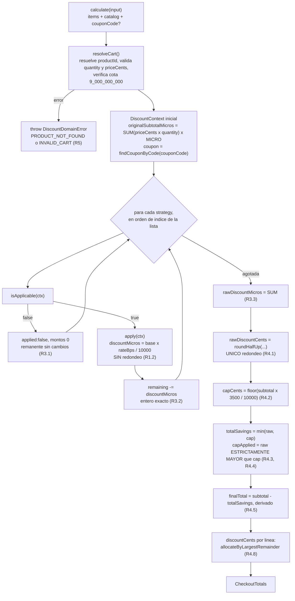

# Design Document

## Overview

Construye `packages/shared/src/discount/`: la interfaz de estrategia y sus tres implementaciones,
la factory, el resolver del carrito, el ensamblador de totales y el motor, más la suite con su
umbral de cobertura. Es la única carpeta del paquete con reglas de negocio.

**Principio rector: el redondeo tiene una sola implementación y un solo punto de aplicación.** La
cascada corre en micro-centavos exactos sin redondear en ningún paso intermedio; el único
`roundHalfUp` sobre montos de la cascada vive en el Ensamblador. Las estrategias devuelven montos
exactos y **no conocen los centavos**.

**Segundo principio: el tope del 35% es un invariante defensivo, no un paso alcanzable.** El
máximo real de la cascada es `1 − (0.90 × 0.95 × 0.85) = 27.325%`, y solo en un carrito 100%
`Tecnologia`. Se implementa y se verifica igual porque protege el margen ante cualquier regla
futura; para probarlo se inyectan estrategias stub, y para demostrarlo en vivo existe el cupón de
extensión `DEMOCAP50`.

## Architecture

```
packages/shared/src/
├── domain/errors.ts                  # + DiscountDomainError, isDiscountDomainError (R5.5)
└── discount/
    ├── discount.types.ts             # DiscountStrategy, DiscountContext, DiscountResult (R1.1, R1.10)
    ├── discount.labels.ts            # DISCOUNT_LABEL: Record<DiscountName, string> (R4.7)
    ├── strategies/
    │   ├── category.discount.ts      # (R1.3-R1.5)
    │   ├── volume.discount.ts        # (R1.6, R1.7)
    │   └── coupon.discount.ts        # (R1.8, R1.9)
    ├── discount-strategy.factory.ts  # (R2.1)
    ├── cart-resolver.ts              # resolución + validación (R5)
    ├── totals-assembler.ts           # el único que redondea (R4)
    └── discount-engine.ts            # (R2.2-R2.5, R3)
```



## Components and Interfaces

Firmas, no cuerpos.

### `discount.types.ts` (R1.1, R1.10)

```ts
export interface ResolvedCartLine {
  readonly productId: string; readonly category: ProductCategory;
  readonly priceCents: number; readonly quantity: number;
}
export interface DiscountContext {
  readonly lines: readonly ResolvedCartLine[];
  readonly originalSubtotalMicros: number;
  readonly remainingSubtotalMicros: number;
  readonly coupon?: Coupon;
}
export interface DiscountResult {
  readonly name: DiscountName; readonly applied: boolean;
  readonly rateBps: number;            // entero 0..10000
  readonly baseAmountMicros: number;
  readonly discountMicros: number;     // exacto, sin redondear
}
export interface DiscountStrategy {
  readonly name: DiscountName; readonly order: number;
  isApplicable(ctx: DiscountContext): boolean;
  apply(ctx: DiscountContext): DiscountResult;
}
```

`DiscountResult` **no tiene campos en centavos**. Es la pieza de tipado que hace cumplir el
principio rector: una estrategia no puede redondear sin que se note, porque no tiene dónde poner
el resultado. `DiscountContext` es `readonly` en todos sus campos, lo que respalda por tipos el
requisito de no mutación.

### Estrategias (R1.3–R1.9)

```ts
export class CategoryDiscount implements DiscountStrategy {  // 'CATEGORY', order 1, 1000 bps
  isApplicable(ctx): boolean;   // alguna línea con category === 'Tecnologia'
  apply(ctx): DiscountResult;
}
export const VOLUME_THRESHOLD_CENTS = 10_000;
export class VolumeDiscount implements DiscountStrategy {    // 'VOLUME', order 2, 500 bps
  isApplicable(ctx): boolean;   // remainingSubtotalMicros > toMicros(10_000)
  apply(ctx): DiscountResult;
}
export class CouponDiscount implements DiscountStrategy {    // 'COUPON', order 3, bps del cupón
  isApplicable(ctx): boolean;   // coupon presente y status === 'active'
  apply(ctx): DiscountResult;
}
```

Tres precisiones que es fácil perder al implementar:

- **Categoría:** la comparación es contra el literal `'Tecnologia'` sin tilde. Comparar contra
  `CATEGORY_LABEL.Tecnologia` no daría error — solo un descuento que deja de aplicarse en
  silencio. Es el fallo que la separación literal/etiqueta existe para prevenir (R1.4).
- **Volumen:** estrictamente mayor, y **en micro-centavos sin redondear antes**. Redondear el
  remanente para compararlo metería un redondeo intermedio por la puerta de atrás y movería la
  frontera (R1.6).
- **Cupón:** `findCouponByCode` devuelve el cupón aunque esté expirado (`SCS-R2.4`); es esta
  estrategia la que decide ignorarlo. El registro informa, la estrategia juzga (R1.8).

### `discount.labels.ts` (R4.7)

```ts
export const DISCOUNT_LABEL: Record<DiscountName, string>;
// CATEGORY → `Descuento ${CATEGORY_LABEL.Tecnologia} 10%`  | VOLUME → '…volumen 5%' | COUPON → 'Cupón'
```

El `label` lo pone el ensamblador desde este `Record`, **no la estrategia**: así una línea no
aplicada conserva `label` no vacío sin que la estrategia se ejecute. Si viviera en la estrategia,
el ensamblador tendría que invocarla incluso con `isApplicable === false`, o el label quedaría
vacío incumpliendo R4.7.

### `cart-resolver.ts` y `discount-engine.ts` (R2, R5)

```ts
export interface DiscountCalculationInput {
  readonly items: readonly CartItem[];
  readonly catalog: readonly Product[];
  readonly couponCode?: string;
}
export const resolveCart: (input: DiscountCalculationInput) => DiscountContext;

export class DiscountEngine {
  constructor(private readonly strategies: readonly DiscountStrategy[]) {}
  calculate(input: DiscountCalculationInput): CheckoutTotals;
}
```

El motor expone `calculate(input)` en lugar de recibir un `DiscountContext` ya construido, y la
razón es de requisitos: R5.3 obliga a lanzar `PRODUCT_NOT_FOUND` para un `productId` ausente y
R5.7 fija el orden de validación; ambas cosas ocurren **antes** de existir el contexto, cuyas
líneas están ya resueltas por definición. Construir el contexto fuera dejaría la validación fuera
de la pieza responsable de ella.

El recorrido es **por índice y no por `order`**: `order` documenta la precedencia de producción,
pero manda la lista. Así un test puede inyectar estrategias en orden inverso y observar el
comportamiento sin que el motor las reorganice a sus espaldas (R2.3).

## Totals Assembler Algorithm

Orden estricto (R4):

1. `rawDiscountMicros` = suma exacta de los `discountMicros` aplicados. Sin redondeo.
2. `rawDiscountCents` = `roundHalfUp(rawDiscountMicros)`. **El único redondeo del cálculo.**
3. `capCents` = `Math.floor(originalSubtotalCents × 3500 / 10000)`. Floor, nunca ceil: el
   descuento no puede *superar* el 35%, y redondear hacia arriba lo violaría por un centavo.
4. `totalSavingsCents` = `Math.min(rawDiscountCents, capCents)`.
5. `capApplied` = `rawDiscountCents > capCents`. Estrictamente mayor: el 35% exacto no trunca.
6. `finalTotalCents` = `originalSubtotalCents − totalSavingsCents`. **Derivado**, nunca por otra
   vía, para que no pueda desincronizarse del desglose.
7. `effectiveDiscountBps` = `Math.round(totalSavings × 10000 / originalSubtotal)`, y `0` sin
   dividir cuando el subtotal es `0`.
8. `discountCents` por línea = `allocateByLargestRemainder(discountMicros[], rawDiscountCents)`.
   La suma iguala `rawDiscountCents` también con `capApplied === true`; ahí
   `rawDiscountCents − totalSavingsCents` es el monto truncado.
9. `baseAmountCents` por línea = `roundHalfUp(baseAmountMicros)`, presentación pura.

### Traza del fixture canónico: 1 × `PROD-001` + `WELCOME2026`

Es el fixture que distingue la política correcta de la incorrecta, y por eso se congela.

| paso | operación | valor exacto |
|------|-----------|--------------|
| subtotal | `129900 × MICRO` | `129_900_000_000` |
| `CATEGORY` | × `1000/10000` | `12_990_000_000` (`12990.0` ¢) |
| remanente | | `116_910_000_000` |
| `VOLUME` | `> toMicros(10000)` → aplica; × `500/10000` | `5_845_500_000` (`5845.5` ¢) |
| remanente | | `111_064_500_000` |
| `COUPON` | × `1500/10000` | `16_659_675_000` (`16659.675` ¢) |
| `rawDiscountMicros` | suma exacta | **`35_495_175_000`** |
| `rawDiscountCents` | `round(35495.175)` | **`35495`** (nunca `35496`) |
| `capCents` | `floor(129900 × 0.35)` | **`45465`** |
| `capApplied` | `35495 > 45465` | **`false`** |
| `effectiveDiscountBps` | `round(2732.486…)` | **`2732`** |
| `finalTotalCents` | `129900 − 35495` | **`94405`** |

Reparto por mayor resto:

| línea | micros | piso | resto | asigna | `discountCents` |
|-------|--------|------|-------|--------|-----------------|
| `CATEGORY` | `12_990_000_000` | `12990` | `0` | — | **`12990`** |
| `VOLUME` | `5_845_500_000` | `5845` | `.5` | — | **`5845`** |
| `COUPON` | `16_659_675_000` | `16659` | `.675` | **+1 ¢** | **`16660`** |
| suma | | `35494` | | | **`35495`** ✓ |

**Por qué defiende contra la regresión:** half-up **por paso** daría
`12990 + 5846 + 16660 = 35496`. Un centavo, pero es el centavo por el que el desglose del frontend
y la orden persistida terminan difiriendo. El test afirma `35495`, así que reintroducir redondeo
intermedio en cualquier estrategia hace fallar la suite.

Segundo fixture, sin cupón: 1 × `PROD-001` → `rawDiscountMicros = 18_835_500_000` y
`rawDiscountCents = 18836`, empate exacto de `.5` resuelto hacia arriba.

## Error Handling

```ts
export class DiscountDomainError extends Error {
  constructor(readonly code: ErrorCode, message: string,
              readonly details?: Readonly<Record<string, unknown>>);
  toApiError(): ApiError;
}
export const isDiscountDomainError: (value: unknown) => value is DiscountDomainError;
```

Sin NestJS, sin códigos HTTP, sin Prisma: el mapeo a `409` / `404` / `400` es de un filtro del
backend. El type guard narrowea desde `unknown` sin assertions — sin él, un `catch (e)` obligaría
a un `as`, que está prohibido.

**Orden de validación (R5.7).** Líneas en orden ascendente de índice y, dentro de cada una:
resolver `productId` (→ `PRODUCT_NOT_FOUND`), validar `quantity` y luego `priceCents` (→
`INVALID_CART`). Solo el primer error, y el cálculo se detiene. Tras el recorrido, la cota de
`9_000_000_000` centavos (R5.6) es la **única guarda de rango con error** del paquete, coherente
con que `money/` no valide. Lanzar antes de ejecutar cualquier estrategia es lo que hace verdadera
la garantía de no mutación: nada llegó a tocar el carrito.

**Lo que NO es un error:**

| Situación | Comportamiento | Req |
|-----------|----------------|-----|
| Carrito de `0` líneas | Totales en `0`, líneas con `applied: false`, sin excepción | R4.10 |
| Cupón ausente, vacío, no registrado o expirado | La cascada continúa; `COUPON` con `applied: false` | R5.4 |
| Ninguna línea de `Tecnologia` | `CATEGORY` con `applied: false` | R1.5 |
| Remanente ≤ `toMicros(10000)` | `VOLUME` con `applied: false` | R1.6 |
| Lista de estrategias vacía | Totales en `0`, `lines: []` | R2.5 |

La distinción es deliberada: **dato corrupto** lanza; **caso legítimo sin descuento** devuelve un
desglose completo con ceros. Un cupón inválido no puede tumbar un checkout.

## Testing Strategy

Tests de ejemplo deterministas con montos fijos verificables a mano. Sin API, sin base de datos,
sin red.

```
discount/strategies/{category,volume,coupon}.discount.spec.ts
discount/{discount-engine,totals-assembler,cart-validation}.spec.ts
discount/{rounding.fixture,cap-invariant}.spec.ts
```

| Test | Afirma | Req |
|------|--------|-----|
| Fixture de redondeo | 1 × `PROD-001` + `WELCOME2026` → `35495`, líneas `12990`/`5845`/`16660`. Half-up por paso daría `35496` y falla | R6.5 |
| Suma de líneas | `Σ discountCents === rawDiscountCents`, con un caso de centavo sobrante y otro con `capApplied` | R6.6 |
| Frontera del volumen | `10000` ¢ → no aplica; `10001` ¢ → aplica con el valor exacto | R6.7 |
| Carrito vacío / corrupto / cupón inválido | Ver R6.9 | R6.9 |
| Cascada multiplicativa | `effectiveDiscountBps === 2732 < 3000` | R3.6 |

**El invariante del tope** se prueba por inyección de stubs tipados (R6.3), porque es inalcanzable
con las reglas reales:

```ts
class StubDiscount implements DiscountStrategy {
  constructor(readonly name: DiscountName, readonly order: number,
              private readonly rateBps: number) {}
  isApplicable(): boolean;                       // siempre true
  apply(ctx: DiscountContext): DiscountResult;   // applyBps(remaining, rateBps)
}
```

Los bps de los stubs se eligen de modo que `× bps / 10000` siga dando enteros exactos en
micro-centavos. Cuatro casos: exceso, `capCents − 1`, `capCents` (no trunca) y `capCents + 1`
(R6.4). Más dos sobre el catálogo real: `DEMOCAP50` → `capApplied === true`, y el barrido de las
cuatro variantes del enunciado → `capApplied === false`, que documenta el hallazgo del tope
inalcanzable y falla si alguien cambia una tasa sin revisarlo (R6.8).

**Cobertura (R6.1):** al `vitest.config.ts` de `monorepo-foundation` se le añade
`thresholds: { lines: 80, branches: 80 }`, que hasta ahora estaba pendiente por no haber módulos
que medir.

## Design Decisions

**Las estrategias no redondean.** Si cada una redondeara, el error se acumularía paso a paso y el
total pasaría a depender del orden de las operaciones en un cálculo que ya es sensible al orden
por precedencia. Peor: cualquier consumidor que redondeara en otro punto obtendría otro total —es
así como el desglose del frontend y la orden persistida terminan difiriendo en un centavo. Por eso
`DiscountResult` no tiene campos en centavos: el tipo hace imposible el error.

**El motor recibe las estrategias por constructor.** No es conveniencia de inyección de
dependencias, es **testabilidad de un invariante**. El tope es inalcanzable con las tasas reales,
así que la única forma de ejercitar el truncamiento es inyectar tasas altas. Si el motor
construyera su lista internamente, la rama del `Math.min` quedaría sin cubrir — y con un umbral
del 80% en ramas, se notaría. De paso, añadir una regla es tocar el factory y no el motor.

**El tope se implementa aunque sea inalcanzable.** `27.325%` es el máximo real. Se implementa
igual porque protege el margen ante reglas futuras, el enunciado lo exige, y su semántica exacta
—floor en `capCents`, estrictamente mayor en `capApplied`— es justo donde un error de un centavo
se colaría sin que nadie lo note.

**`DEMOCAP50` existe y está marcado como extensión.** Sin él no hay camino de datos que dispare la
alerta del tope en una demo en vivo. `isDemoExtension: true` lo declara como extensión ajena al
enunciado, y la marca no es decorativa: R6.8 la usa para **excluirlo** del barrido que afirma
`capApplied === false`. Sin el campo, ese test codificaría el código del cupón a mano.

**El motor valida; las utilidades de dinero no.** El motor conoce el índice de la línea y el
`productId`, así que emite un `details` accionable; una guarda dentro de `roundHalfUp` solo sabría
que recibió un `NaN`. Además, cada guarda inalcanzable en `money/` sería una rama que el umbral
obliga a cubrir con un test que no prueba nada real.

### Fuera de alcance deliberado

El **property-based testing** (generador con semilla fija y 1000 casos por propiedad) queda fuera:
los invariantes que verificaría —conservación del subtotal, suma de líneas, rangos del tope,
determinismo— ya están cubiertos por los casos borde de R6, que son deterministas y auditables a
mano. Para el alcance de esta entrega, el coste de construir los generadores no se justifica
frente a lo que añadiría sobre R6.4–R6.9.
